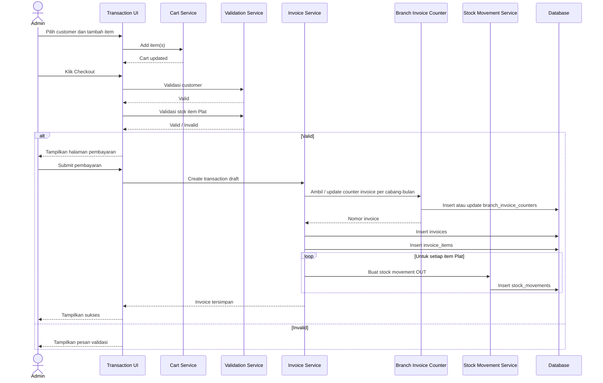
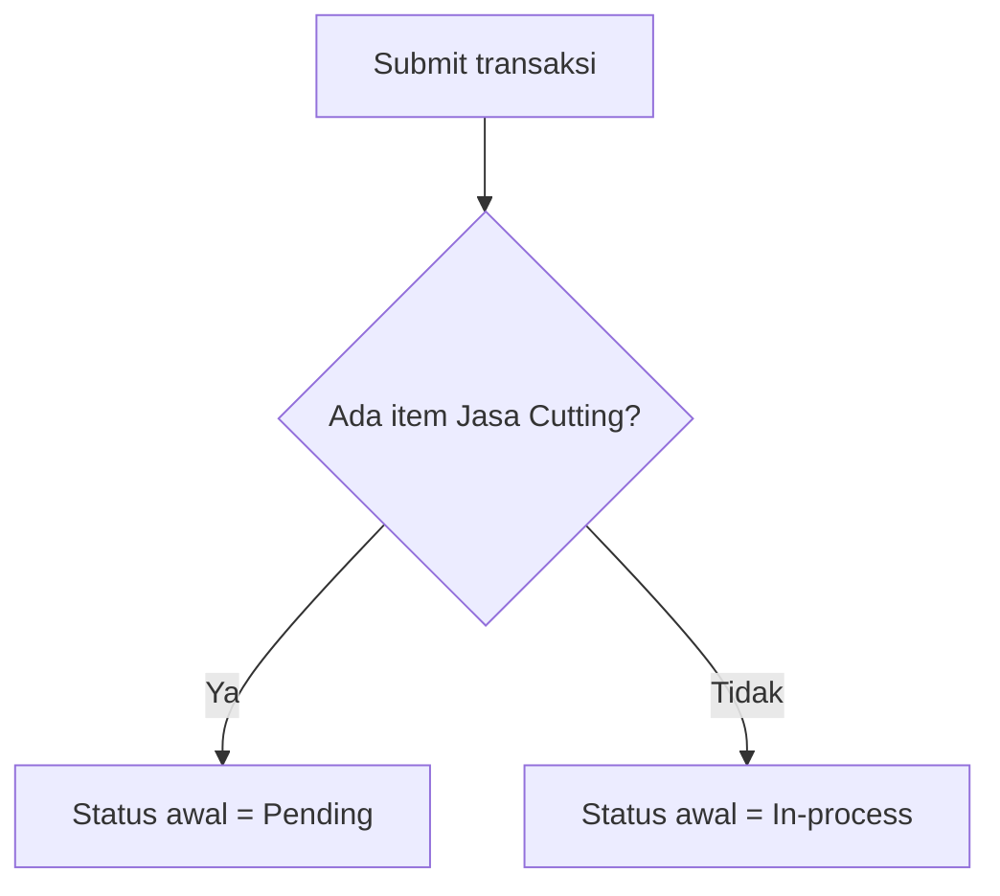
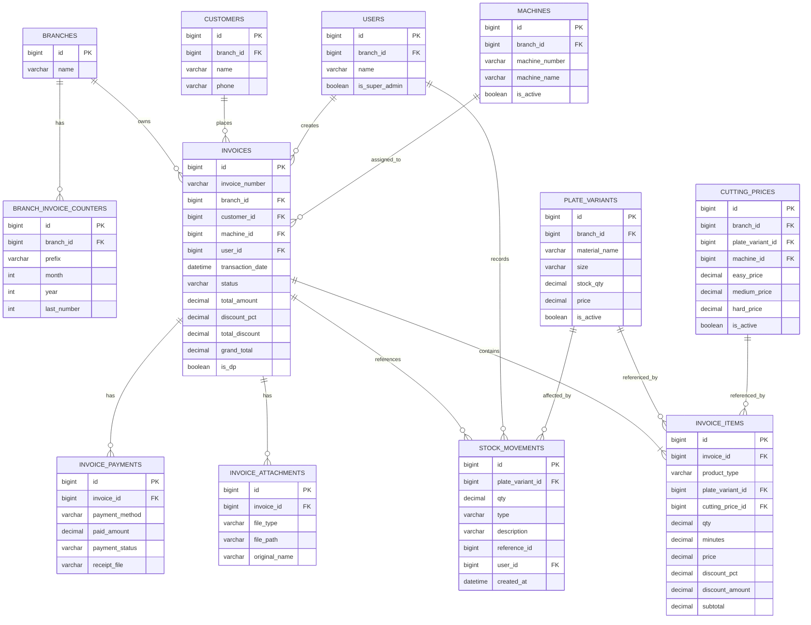

# PRD: Workflow Transaksi Produk Plat dan Jasa Cutting

## 1. Ringkasan Produk

Dokumen ini mendefinisikan kebutuhan produk untuk modul transaksi penjualan pada sistem Pioneer CNC, dengan fokus pada pemesanan produk `Plat` dan `Jasa Cutting`, proses checkout, pembayaran, pengelolaan status invoice, serta dampaknya ke stok.

Modul ini harus mendukung alur transaksi yang cepat untuk penjualan plat biasa, namun tetap cukup ketat untuk pesanan jasa cutting yang membutuhkan validasi desain, penentuan mesin, dan tahapan produksi.

## 2. Latar Belakang

Saat ini transaksi melibatkan dua jenis produk dengan karakteristik yang berbeda:

- `Plat`: produk material dengan stok fisik.
- `Jasa Cutting`: layanan proses cutting dengan harga bertingkat dan kebutuhan validasi desain.

Perbedaan perilaku kedua jenis produk menyebabkan kebutuhan workflow yang tidak bisa disamakan. Sistem perlu membedakan:

- transaksi yang bisa langsung dikerjakan,
- transaksi yang perlu divalidasi sebelum dikerjakan,
- transaksi yang memengaruhi stok,
- transaksi yang memerlukan dokumen pendukung seperti file desain cutting dan bukti pembayaran.

## 3. Tujuan

- Menyediakan workflow transaksi yang konsisten dari pemilihan customer hingga invoice terbentuk.
- Memisahkan perlakuan transaksi `Plat` dan `Jasa Cutting` sesuai kebutuhan operasional.
- Mengurangi kesalahan input saat menentukan harga, stok, metode pembayaran, dan status pesanan.
- Menyediakan status invoice yang jelas untuk tim admin dan produksi.
- Memastikan stok berkurang otomatis saat item `Plat` terjual.
- Menyediakan dasar implementasi yang siap dibawa ke desain UI, backend, dan database.

## 4. Non-Goals

- Belum mencakup refund penuh atau parsial.
- Belum mencakup manajemen produksi detail per langkah mesin.
- Belum mencakup approval multi-level.
- Belum mencakup integrasi payment gateway.
- Belum mencakup pengiriman barang/logistik.

## 5. Aktor

- `Super Admin`
  Dapat memilih kantor cabang saat membuat transaksi.

- `Admin Cabang`
  Hanya dapat membuat transaksi untuk cabang sesuai `user()->branch_id`.

- `Tim Produksi`
  Menggunakan status invoice dan dokumen desain untuk memproses pekerjaan cutting.

- `Customer`
  Tidak berinteraksi langsung ke sistem, tetapi menjadi entitas utama transaksi.

## 6. Definisi Status Invoice

Terdapat 4 status invoice:

- `Pending`
  Digunakan bila transaksi mengandung minimal satu item `Jasa Cutting`.
  Admin perlu memvalidasi pesanan, upload file desain cutting, dan memasukkan nomor mesin.

- `In-process`
  Digunakan bila transaksi hanya berisi item `Plat`, atau setelah transaksi `Pending` diproses.

- `Completed`
  Digunakan saat pekerjaan atau penyerahan pesanan selesai.

- `Cancel`
  Digunakan saat pesanan dibatalkan.

### Aturan Status Otomatis

- Jika semua item adalah `Plat`, maka status invoice awal = `In-process`.
- Jika ada minimal satu item `Jasa Cutting`, maka status invoice awal = `Pending`.

## 7. Problem Statement

Tanpa workflow yang baku, tim operasional berisiko mengalami:

- status transaksi yang tidak konsisten,
- stok plat tidak akurat,
- harga jasa cutting tidak tervalidasi,
- data customer dan cabang salah pilih,
- desain cutting tidak terdokumentasi,
- dokumen pembayaran tidak terhubung ke transaksi.

## 8. Scope Fitur

### In Scope

- Pemilihan cabang sesuai role user.
- Pencarian dan pemilihan customer.
- Menambah item ke cart dari modal daftar produk.
- Mengubah harga, qty, dan diskon item tertentu di cart.
- Hapus item dari cart.
- Validasi customer dan stok saat checkout.
- Halaman pembayaran.
- Penyimpanan invoice dan invoice items.
- Penyimpanan nomor invoice per cabang dan bulan.
- Penyimpanan bukti pembayaran.
- Penyimpanan file desain cutting.
- Otomatisasi status invoice awal.
- Pencatatan `stock_movements` untuk item `Plat`.

### Out of Scope Sementara

- Multi-payment per invoice.
- Edit invoice setelah submit.
- Retur barang.
- Penjadwalan mesin detail.
- Notifikasi email/WhatsApp.

## 9. Business Rules

### 9.1 Cabang

- Jika user adalah `Super Admin`, tampilkan dropdown cabang.
- Jika bukan `Super Admin`, `branch_id` otomatis mengikuti `user()->branch_id`.

### 9.2 Customer

- Input customer wajib melalui dropdown searchable.
- Checkout tidak dapat dilanjutkan jika customer belum dipilih.

### 9.3 Produk

- Hanya produk dengan `is_active = TRUE` yang ditampilkan di modal tambah item.
- List produk mendukung dua tipe:
  - `Plat`
  - `Jasa Cutting`

### 9.4 Harga

- Untuk `Plat`, harga menggunakan harga jual plat yang aktif.
- Untuk `Jasa Cutting`, harga dapat disesuaikan dari pilihan kompleksitas, misalnya `Easy`, `Medium`, dan seterusnya.
- Diskon item hanya berlaku untuk `Jasa Cutting`.

### 9.5 Stok

- Stok hanya relevan untuk `Plat`.
- Saat checkout, sistem wajib memvalidasi ketersediaan stok.
- Saat invoice tersimpan, item `Plat` harus menulis `stock_movements` dengan tipe `OUT`.

### 9.6 Pembayaran

- Metode bayar:
  - `Transfer`
  - `Cash`
  - `Pay Later`
- Jika `jumlah bayar < total tagihan`, transaksi ditandai sebagai `DP`.
- Sistem mendukung upload bukti pembayaran.

### 9.7 Dokumen Desain

- Untuk invoice yang mengandung `Jasa Cutting`, sistem harus mendukung upload multiple file desain.
- Nomor mesin perlu disimpan untuk invoice yang membutuhkan proses cutting.

## 10. User Flow

### 10.1 Pembuatan Transaksi

1. User membuka halaman transaksi.
2. User memilih cabang atau sistem mengisi otomatis.
3. User memilih customer.
4. User klik `Tambah Item`.
5. Sistem menampilkan modal daftar produk aktif.
6. User memfilter dan memilih item.
7. User klik `Add`.
8. Item masuk ke `Cart` dan tampil di tabel pesanan.
9. User dapat:
   - `Clear`
   - `Update`
   - `Checkout`

### 10.2 Checkout

1. User klik `Checkout`.
2. Sistem memvalidasi customer.
3. Sistem memvalidasi stok item `Plat`.
4. Jika valid, user diarahkan ke halaman pembayaran.

### 10.3 Pembayaran dan Submit

1. User melihat ringkasan item final.
2. User mengisi diskon pembayaran.
3. User mengisi jumlah bayar.
4. User memilih metode bayar.
5. User upload bukti pembayaran.
6. Jika perlu, user upload file desain cutting dan memilih mesin.
7. User klik `Submit`.
8. Sistem:
   - menentukan status awal invoice,
   - generate nomor invoice,
   - simpan invoice,
   - simpan invoice items,
   - simpan payment metadata,
   - simpan file pendukung,
   - simpan stock movement untuk item `Plat`.

## 11. Functional Requirements

### 11.1 Halaman Transaksi

- Sistem harus menampilkan field cabang sesuai role user.
- Sistem harus menyediakan dropdown customer yang searchable.
- Sistem harus menyediakan tombol `Tambah Item`.
- Sistem harus menampilkan tabel pesanan.

### 11.2 Tabel Pesanan

Kolom:

- `No`
- `Nama Produk`
- `Harga`
- `Jml`
- `Discount (%)`
- `Total`
- `Checkbox Hapus`

Perilaku:

- Tombol `Clear` mengosongkan cart dan tabel.
- Tombol `Update` menyimpan perubahan cart.
- Tombol `Checkout` menjalankan validasi dan membuka halaman pembayaran.

### 11.3 Modal Tambah Item

- Sistem harus menampilkan filter jenis produk.
- Sistem harus menampilkan tabel produk aktif.
- Sistem harus mendukung pencarian pada nama produk, ukuran, dan mesin.
- Untuk `Plat`, kolom mesin tampil `-`.
- Untuk `Jasa Cutting`, kolom harga menampilkan rentang `harga termurah - harga tertinggi`.
- Tombol `Cancel` menutup modal dan membersihkan pilihan.
- Tombol `Add` menambah item ke cart.

### 11.4 Halaman Pembayaran

- Sistem menampilkan ringkasan item final yang tidak bisa diedit.
- Sistem menampilkan:
  - `Sub Total`
  - `Discount Pembayaran (%)`
  - `Total Tagihan`
  - `Jumlah Bayar`
  - `Metode Bayar`
  - `Upload Bukti Pembayaran`
- Jika ada item `Jasa Cutting`, sistem juga menampilkan:
  - `Upload File Desain`
  - `Nomor Mesin`
- Tombol `Submit` menyimpan seluruh transaksi.

### 11.5 Status dan Aksi Invoice

#### Status `Pending`

Tombol yang tersedia:

- `Cancel`
- `Process`
- `Print SPK`
- `Completed`

#### Status `In-process`

Tombol yang tersedia:

- `Cancel`
- `Completed`

#### Status `Completed`

- Tidak ada aksi utama operasional selain lihat detail/print jika dibutuhkan.

#### Status `Cancel`

- Invoice menjadi tidak aktif untuk proses lanjutan.

## 12. Acceptance Criteria

### AC-01 Role Cabang

- Super Admin dapat memilih cabang saat membuat transaksi.
- Admin Cabang tidak dapat memilih cabang lain.

### AC-02 Validasi Customer

- Checkout gagal jika customer belum dipilih.

### AC-03 Validasi Stok

- Checkout gagal jika qty item `Plat` melebihi stok.

### AC-04 Status Awal

- Invoice berisi hanya `Plat` harus otomatis `In-process`.
- Invoice berisi minimal satu `Jasa Cutting` harus otomatis `Pending`.

### AC-05 Diskon Item

- Diskon item hanya dapat diinput untuk `Jasa Cutting`.

### AC-06 Pembayaran DP

- Jika jumlah bayar kurang dari total tagihan, transaksi ditandai sebagai DP.

### AC-07 Stock Movement

- Setiap item `Plat` yang berhasil tersimpan harus membuat satu record `stock_movements` dengan tipe `OUT`.

### AC-08 Counter Invoice

- Nomor invoice harus unik per `branch_id`, `prefix`, `month`, dan `year`.

## 13. Low-Fidelity Wireframe

### 13.1 Halaman Transaksi

```text
+----------------------------------------------------------------------------------+
| Transaksi Produk                                                                 |
+----------------------------------------------------------------------------------+
| Cabang           : [Dropdown Cabang / Auto by User]                              |
| Customer         : [ Searchable Customer Dropdown                         ]       |
| [ Tambah Item ]                                                                  |
+----------------------------------------------------------------------------------+
| Tabel Pesanan                                                                    |
+----+----------------------+-----------+------+-------------+-------------+-------+
| No | Nama Produk          | Harga     | Jml  | Discount %  | Total       | Hapus |
+----+----------------------+-----------+------+-------------+-------------+-------+
| 1  | Plat Alumunium 1 mm  | 200.000   | 2    | -           | 400.000     | [ ]   |
| 2  | Jasa Cutting Plasma  | 250.000   | 1    | 10          | 225.000     | [ ]   |
+----+----------------------+-----------+------+-------------+-------------+-------+
| [ Clear ]     [ Update ]     [ Checkout ]                                        |
+----------------------------------------------------------------------------------+
```

### 13.2 Modal Tambah Item

```text
+----------------------------------------------------------------------------------+
| Tambah Item                                                                      |
+----------------------------------------------------------------------------------+
| Jenis Produk : [ Plat | Jasa Cutting | Semua ]                                   |
| Search Nama  : [....................]   Search Mesin : [....................]    |
+----------------+---------+------+----------+-------------------+-----------------+
| Plat           | Ukuran  | Stok | Mesin    | Harga             | Pilih           |
+----------------+---------+------+----------+-------------------+-----------------+
| Alumunium      | 1       | 5    | -        | 200.000           | [ ]             |
| Alumunium      | 1       | -    | Plasma   | 200rb - 300rb     | [ ]             |
+----------------+---------+------+----------+-------------------+-----------------+
| [ Cancel ]                                                        [ Add ]        |
+----------------------------------------------------------------------------------+
```

### 13.3 Halaman Pembayaran

```text
+----------------------------------------------------------------------------------+
| Pembayaran                                                                       |
+----------------------------------------------------------------------------------+
| Ringkasan Pesanan                                                                |
+----+----------------------+-----------+------+-------------+---------------------+
| No | Nama Produk          | Harga     | Jml  | Discount %  | Total               |
+----+----------------------+-----------+------+-------------+---------------------+
| 1  | Plat Alumunium 1 mm  | 200.000   | 2    | -           | 400.000             |
| 2  | Jasa Cutting Plasma  | 250.000   | 1    | 10          | 225.000             |
+----+----------------------+-----------+------+-------------+---------------------+
| Sub Total              : 625.000                                                |
| Discount Pembayaran %  : [ 5 ]                                                  |
| Total Tagihan          : 593.750                                                |
| Jumlah Bayar           : [ 300.000 ]   -> jika kurang, tandai DP                |
| Metode Bayar           : [ Transfer | Cash | Pay Later ]                        |
| Bukti Pembayaran       : [ Upload File ]                                        |
| File Desain Cutting    : [ Upload Multiple Files ]                              |
| Nomor Mesin            : [ Input / Dropdown Mesin ]                             |
|                                                                  [ Submit ]     |
+----------------------------------------------------------------------------------+
```

## 14. Sequence Diagram

### 14.1 Sequence Utama Transaksi



### 14.2 Penentuan Status Awal Invoice



## 15. Database Design

### 15.1 Entitas Utama

- `branches`
- `customers`
- `users`
- `machines`
- `branch_invoice_counters`
- `invoices`
- `invoice_items`
- `invoice_payments` atau tabel pembayaran setara
- `invoice_attachments`
- `stock_movements`
- `plate_variants`
- `cutting_prices`

### 15.2 ER Diagram



## 16. Usulan Struktur Data Detail

### 16.1 invoices

- `invoice_number`
- `branch_id`
- `customer_id`
- `machine_id`
- `user_id`
- `transaction_date`
- `status`
- `total_amount`
- `discount_pct`
- `total_discount`
- `grand_total`
- `is_dp`

### 16.2 invoice_items

- `invoice_id`
- `product_type`
- `plate_variant_id`
- `cutting_price_id`
- `qty`
- `minutes`
- `price`
- `discount_pct`
- `discount_amount`
- `subtotal`

### 16.3 stock_movements

Untuk item `Plat`, insert:

- `plate_variant_id = invoice_items.plate_variant_id`
- `qty = invoice_items.qty`
- `type = "OUT"`
- `description = "SALE"`
- `reference_id = invoice_id`
- `user_id = user()->id`

## 17. Validation Rules

- Customer wajib dipilih.
- Minimal 1 item wajib ada di cart.
- Qty harus lebih dari 0.
- Qty item `Plat` tidak boleh melebihi stok.
- Diskon item tidak boleh kurang dari 0 dan tidak boleh lebih dari 100.
- Diskon pembayaran tidak boleh kurang dari 0 dan tidak boleh lebih dari 100.
- Jumlah bayar tidak boleh negatif.
- Metode bayar wajib dipilih saat submit.
- Untuk invoice dengan `Jasa Cutting`, file desain cutting dan mesin harus tervalidasi sesuai aturan bisnis akhir.

## 18. Edge Cases

- Cart kosong lalu user klik checkout.
- Customer dipilih, tapi salah satu item sudah tidak aktif.
- Stok berubah setelah item masuk cart tetapi sebelum checkout.
- Invoice mengandung campuran `Plat` dan `Jasa Cutting`.
- `Pay Later` dengan `jumlah bayar = 0`.
- Upload bukti pembayaran kosong untuk `Pay Later`.
- Upload file desain lebih dari satu file.
- Item `Jasa Cutting` memiliki `minutes = null` saat tidak dibutuhkan.

## 19. Open Questions

- Apakah `machine_id` disimpan di level invoice atau per item cutting?
- Apakah satu invoice boleh memiliki beberapa mesin untuk beberapa item cutting?
- Apakah bukti pembayaran wajib untuk `Transfer` dan `Cash`, atau hanya `Transfer`?
- Apakah `discount pembayaran` boleh dipakai untuk invoice yang juga memiliki diskon per item?
- Apakah status `Completed` bisa dipilih langsung dari `Pending`, atau harus melalui `Process/In-process`?
- Apakah `Print SPK` hanya muncul untuk invoice dengan `Jasa Cutting`?
- Apakah `Pay Later` otomatis menghasilkan payment record kosong, atau cukup flag di invoice?

## 20. Rekomendasi Implementasi

- Gunakan pemisahan service untuk:
  - cart handling,
  - invoice number generation,
  - payment persistence,
  - stock movement.
- Simpan status invoice sebagai enum terkontrol.
- Pisahkan attachment:
  - `payment_receipt`
  - `cutting_design`
- Untuk mesin, pertimbangkan relasi per item bila satu invoice dapat dikerjakan oleh lebih dari satu mesin.
- Tambahkan audit fields standar:
  - `created_by`
  - `updated_by`
  - `created_at`
  - `updated_at`

## 21. Lampiran Ringkas Workflow

- `Plat only` -> langsung `In-process`
- `Ada Jasa Cutting` -> `Pending`
- Checkout harus memvalidasi customer dan stok
- Submit transaksi harus:
  - generate invoice counter,
  - insert invoice,
  - insert invoice items,
  - insert stock movement untuk item `Plat`,
  - simpan pembayaran,
  - simpan attachment yang relevan
